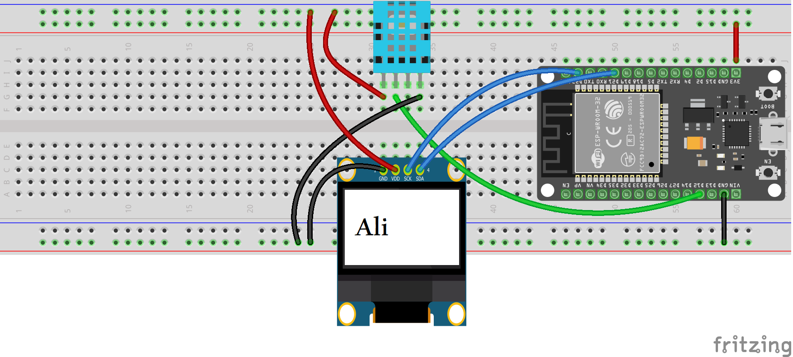

# ESP32 DHT11 OLED Web Monitor

A temperature and humidity monitoring system based on ESP32 and DHT11, featuring both an OLED display and a Wi-Fi web interface.

## Features

- 🌡️ Real-time temperature measurement using DHT11
- 💧 Real-time humidity measurement using DHT11
- 🖥️ Local display using an OLED screen
- 📡 Wi-Fi connectivity
- 🌐 HTTP Web Server
- 📱 Remote monitoring through a web browser
- 🔄 Simultaneous local and web-based monitoring

## Hardware

- ESP32 Development Board
- DHT11 Temperature & Humidity Sensor
- OLED Display (SSD1306)
- Breadboard
- Jumper Wires

## Software

- Arduino IDE
- ESP32 Arduino Core
- DHT Sensor Library
- Adafruit GFX Library
- Adafruit SSD1306 Library

## How It Works

The DHT11 sensor measures the temperature and humidity of the environment.

The ESP32 processes the sensor data and displays the measurements locally on an OLED display.

At the same time, the ESP32 connects to a Wi-Fi network and runs an HTTP web server. The measured temperature and humidity can then be monitored remotely through a web browser on a device connected to the same network.

## Circuit



## Demo

The following video demonstrates the ESP32 DHT11 monitoring system, including the OLED display and web-based monitoring interface.

[ESP32 DHT11 Web Monitor Demo](ESP32-DHT11-Web-Monitor.mp4)

## Setup

1. Install the ESP32 board package in Arduino IDE.
2. Install the required libraries.
3. Open the `.ino` file.
4. Replace the Wi-Fi credentials:

```cpp
const char* ssid = "YOUR_WIFI_SSID";
const char* password = "YOUR_WIFI_PASSWORD";
